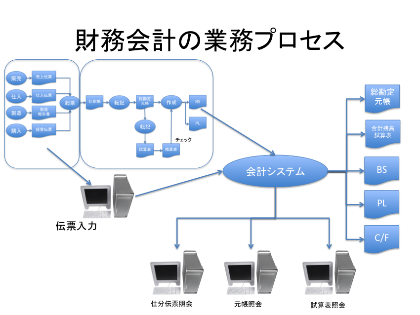
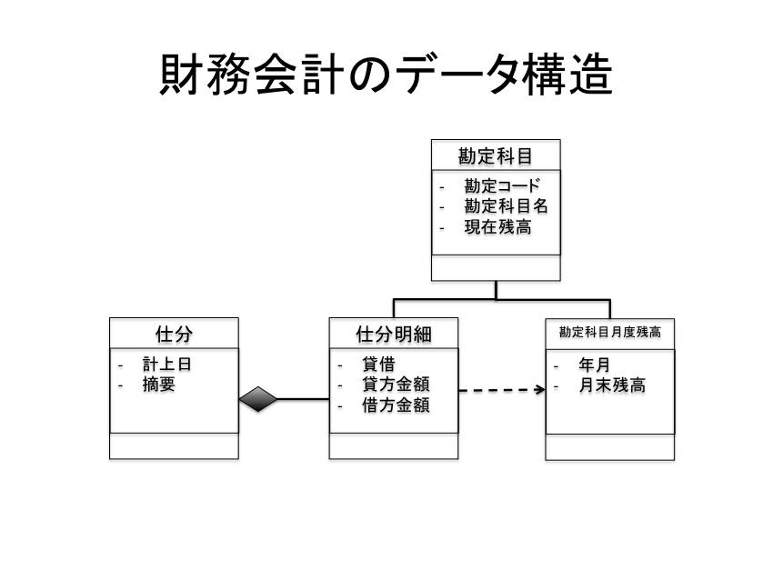
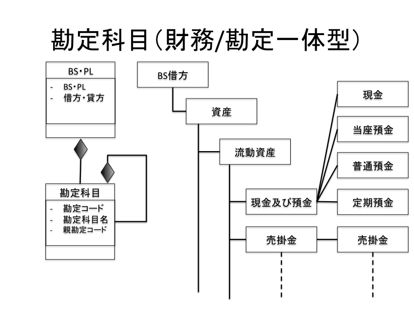
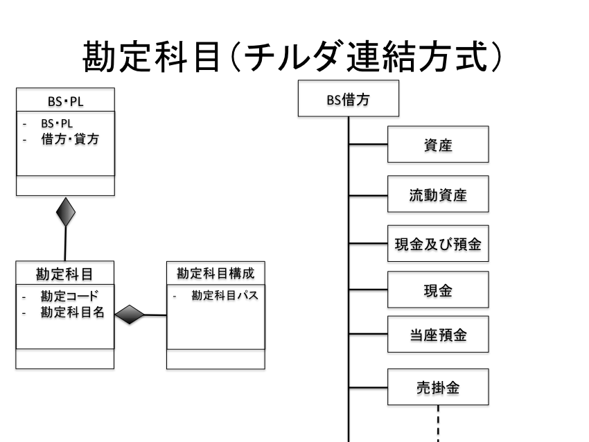
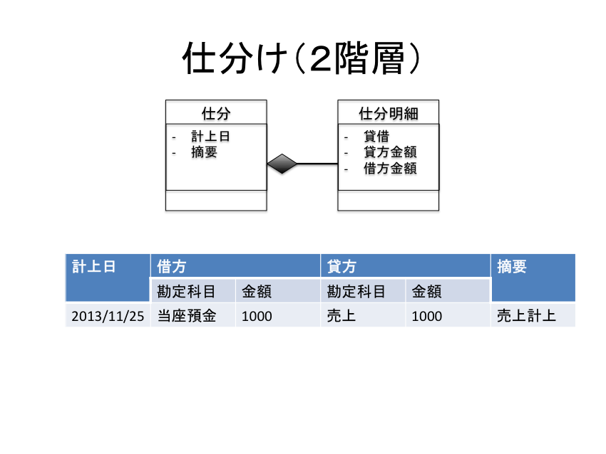
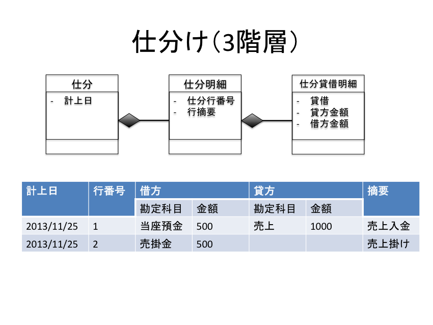

財務会計モデルをRailsで実装
================

# 目的 #
財務会計システムをRailsで実装する

# 前提 #
| ソフトウェア   | バージョン   | 備考        |
|:---------------|:-------------|:------------|
| OS X           |10.8.5        |             |
| ruby           |1.9.3-p392    |             |
| rails          |3.2.13        |             |
| bootstrap      |3.0.2         |             |
| rspec          |2.0           |             |
| cucmber        |1.3.1         |             |

# 構成 #
+ [設計](#chap1)
  + [財務会計とは](#chap1-1)
  + [財務会計の業務プロセス](#chap1-2)
  + [財務会計のデータ構造](#chap1-3)  
  + [財務諸表と勘定科目のデータ設計アプローチ](#chap1-4)
  
+ [実装](#chap2)
  + [セットアップ](#chap2-1)
  + [勘定科目](#chap2-2)
      + 財務/勘定一体型
      + 財務/勘定分離型
      + チルダ連結型
  + [仕分](#chap2-3)
      + ２階層
      + ３階層

# 詳細 #

## <a name="chap1">設計 ##

### <a name="chap1-1">財務会計とは ###
+ 利害関係者にお金を幾ら持っていて幾ら使って幾ら稼いだかを知ってもらうための記録・計算・管理プロセス

    + 利害関係者（お金を貸したり借りたり取り立てたりする人）
      + 株主・債権者・徴税当局
    + 財政状態を記録・計算・管理する（全財産は幾ら？）
      + 貸借対照表（B/S Balance Sheet）
    + 経営成績を記録・計算・管理する（幾ら使って幾ら稼いだ？）
      + 損益計算書（P/L Profit and Loss Statement)

### <a name="chap1-2">財務会計の業務プロセス ###

### <a name="chap1-3">財務会計のデータ構造 ###

### <a name="chap1-4">財務諸表と勘定科目のデータ設計アプローチ ###

#### 勘定科目 ####

#### 仕分 ####

## <a name="chap2">実装 ##

### <a name="chap2-1">セットアップ ###

    $ rvm use ruby-1.9.3-p392
    $ rvm gemset create rails_accounting
    $ rvm use ruby-1.9.3-p392@rails_accounting
    $ gem i rails --version 3.2.13 --no-ri

### <a name="chap2-2">勘定科目 ###

#### 財務/勘定一体型 ####

    $ rails new chap2-2-1 -m ./bdd_template.rb

#### 財務/勘定分離型 ####

    $ rails new chap2-2-2 -m ./bdd_template.rb

#### チルダ連結型 ####

    $ rails new chap2-2-3 -m ./bdd_template.rb

### <a name="chap2-3">仕分 ###

#### ２階層 ####

    $ rails new chap2-3-1 -m ./bdd_template.rb

#### ３階層 ####

    $ rails new chap2-3-1 -m ./bdd_template.rb

# 参照 #
[UMLによる一気通貫DBシステム設計](http://www.amazon.co.jp/UML%E3%81%AB%E3%82%88%E3%82%8B%E4%B8%80%E6%B0%97%E9%80%9A%E8%B2%ABDB%E3%82%B7%E3%82%B9%E3%83%86%E3%83%A0%E8%A8%AD%E8%A8%88-DB-Magazine-SELECTION-%E7%B4%B0%E5%B7%9D/dp/4798113425)

[グラス片手にデータベース設計会計システム編](http://www.amazon.co.jp/%E3%82%B0%E3%83%A9%E3%82%B9%E7%89%87%E6%89%8B%E3%81%AB%E3%83%87%E3%83%BC%E3%82%BF%E3%83%99%E3%83%BC%E3%82%B9%E8%A8%AD%E8%A8%88~%E8%B2%A9%E5%A3%B2%E7%AE%A1%E7%90%86%E3%82%B7%E3%82%B9%E3%83%86%E3%83%A0%E7%B7%A8-DBMagazine-SELECTION-%E6%A2%85%E7%94%B0-%E5%BC%98%E4%B9%8B/dp/479810566X)
